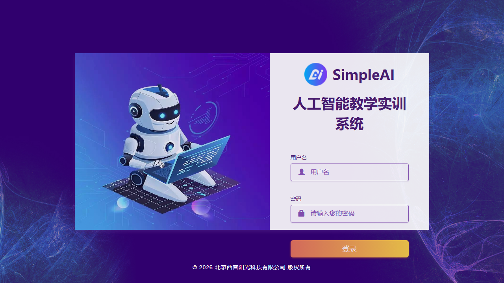

# SimpleAI 智能系统开发及部署实训

> **SimpleAI Intelligent System Development & Deployment Training**
>
> 19 章节 · 103 实验 · 全部在实验服务器上真实执行
>
> TensorFlow / OpenCV / CNN & RNN / 图像处理 / 特征提取 / 爬虫 / 语音识别 / 区块链

## 项目概述

本仓库为 **SimpleAI 人工智能教学实训系统** 上完成的「智能系统开发及部署实训」课程全部实验成果。
所有实验均在实验服务器（10.248.6.104）上真实执行，产出带中文标注的结果图表、执行日志和结构化数据。

- **平台**：SimpleAI 人工智能教学实训系统
- **课程**：智能系统开发及部署实训
- **教师**：张罡
- **时间**：2026-06-27 ~ 2026-07-08
- **总章节**：19 · **总实验**：103



## 目录结构

```
├── README.md                          ← 本文件
├── 实训报告模板.docx                   ← 课程报告模板
├── crawled_data/
│   └── 02_all_requirements.md         ← 全部 103 个实验要求汇总
├── skill/                             ← Claude Code Skill：真实实验流水线工具集
│   ├── README.md                      #   使用说明与踩坑记录
│   ├── SKILL.md                       #   Skill 定义
│   ├── references/                    #   连接故障对策 + 实验设计配方
│   └── scripts/                       #   srv.py + terminal_screenshot.py
├── 第01章_TensorFlow环境搭建/          ← 1 个实验
├── 第02章_TensorFlow基础知识与可视化表示/ ← 2 个实验
├── 第03章_图像聚类与搜索/              ← 7 个实验
├── 第04章_CNN与RNN原理与实现/          ← 4 个实验
├── 第05章_基本图像处理运算/            ← 9 个实验
├── 第06章_图像滤波/                    ← 2 个实验
├── 第07章_图像分割/                    ← 2 个实验
├── 第08章_OpenCV_OpenGL/              ← 5 个实验
├── 第09章_特征提取/                    ← 7 个实验
├── 第10章_描述子与角点检测/            ← 4 个实验
├── 第11章_CNN与RNN实例/               ← 7 个实验
├── 第12章_TensorFlow综合人脸识别/      ← 1 个实验
├── 第13章_三维视觉/                    ← 2 个实验
├── 第14章_运动对象检测/               ← 5 个实验
├── 第15章_网络爬虫/                    ← 13 个实验
├── 第16章_概率图模型/                  ← 4 个实验
├── 第17章_机器学习图像处理/            ← 6 个实验
├── 第18章_语音识别/                    ← 5 个实验
└── 第19章_区块链/                      ← 17 个实验
```

## 章节概览

| 章节 | 名称 | 实验数 | 主要内容 |
|------|------|--------|----------|
| 第01章 | TensorFlow环境搭建 | 1 | TF 安装、张量运算、自动微分、广播机制 |
| 第02章 | TensorFlow基础知识与可视化表示 | 2 | 数据流水线、线性回归、TensorBoard 可视化 |
| 第03章 | 图像聚类与搜索 | 7 | 层次/K-means/谱聚类、SIFT-BoVW、视觉词汇、哈希检索 |
| 第04章 | CNN与RNN原理与实现 | 4 | CNN/NiN/RNN/BPTT 真实训练 |
| 第05章 | 基本图像处理运算 | 9 | 读取显示、灰度化、直方图、几何变换、颜色空间 |
| 第06章 | 图像滤波 | 2 | 空间域滤波、频率域滤波 |
| 第07章 | 图像分割 | 2 | 阈值分割、区域生长与分水岭 |
| 第08章 | OpenCV/OpenGL | 5 | 绘图函数、鼠标交互、Trackbar、基本运算、性能优化 |
| 第09章 | 特征提取 | 7 | SIFT/HOG/LBP/颜色直方图/边缘/GLCM/综合对比 |
| 第10章 | 描述子与角点检测 | 4 | Harris/ShiTomasi/SIFT 匹配/图像拼接 |
| 第11章 | CNN与RNN实例 | 7 | CNN 分类/迁移学习/RNN 文本分类/时间序列/GRU vs LSTM/自编码器 |
| 第12章 | TensorFlow综合人脸识别 | 1 | TF 人脸识别实战 |
| 第13章 | 三维视觉 | 2 | 立体视觉与深度图、三维点云 |
| 第14章 | 运动对象检测 | 5 | 帧差法/背景减除/光流/MeanShift/综合对比 |
| 第15章 | 网络爬虫 | 13 | HTTP/URL/HTML/正则/JSON-CSV/动态网页/反爬/Scrapy/异步/分布式 |
| 第16章 | 概率图模型 | 4 | 贝叶斯网络/HMM/条件随机场/马尔可夫随机场 |
| 第17章 | 机器学习图像处理 | 6 | SVM/KNN/随机森林/KMeans 分割/PCA 压缩 |
| 第18章 | 语音识别 | 5 | 语音信号基础/端点检测/MFCC/识别模型/语音合成 |
| 第19章 | 区块链 | 17 | 哈希/工作量证明/加密货币/默克尔树/智能合约/DeFi/NFT |

## 每个实验文件夹包含

```
实验文件夹/
├── code.py                      ← 源码：服务器上真实运行的 Python 代码
├── 01_*.png                     ← 单独图片：每个步骤的独立图表
├── 02_*.png                     ←   （中文标注，编号排序）
├── 03_*.png                     ←
├── terminal_code.png            ← 拼接图片：终端风格代码截图
├── terminal_output.png          ← 拼接图片：终端风格执行输出
├── execution.log                ← 执行日志（可选）
└── results.json                 ← 结构化结果数据（可选）
```

三类输出：
- **源码** (`code.py`)：自包含 Python 脚本，可在服务器上独立运行
- **单独图片** (`0X_*.png`)：每个实验步骤/概念一张独立 PNG
- **拼接图片** (`terminal_code.png` + `terminal_output.png`)：终端主题截图，代码着色 + stdout 着色

## 技术栈

| 类别 | 工具 |
|------|------|
| 深度学习 | TensorFlow 2.x, Keras |
| 计算机视觉 | OpenCV 3.4.2 (含 SIFT/xfeatures2d) |
| 机器学习 | scikit-learn 0.23.2 |
| 可视化 | matplotlib 3.3.3 (中文支持) |
| 平台 | SimpleAI 人工智能教学实训系统 |
| 执行环境 | Ubuntu 18.04 实验服务器 (10.248.6.104) |

## Skill 工具集

本仓库附带一个 **Claude Code Skill**（`skill/` 目录），封装了在实验服务器上跑真实实验的完整流水线：

- **`scripts/srv.py`** — 韧性 SSH/SFTP 助手（带重试、断点续传、追加上传）
- **`scripts/terminal_screenshot.py`** — 终端风格截图工具（中文支持、语法高亮）
- **`references/connection.md`** — 三级 SSH 链路故障对策
- **`references/experiment-recipes.md`** — 实验设计配方

安装：`cp -r skill/ ~/.claude/skills/shixun-real-experiments/`  
详见 [`skill/README.md`](skill/README.md)

## License

MIT License — 仅供学习参考。
